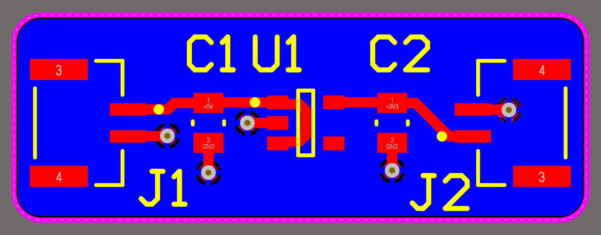
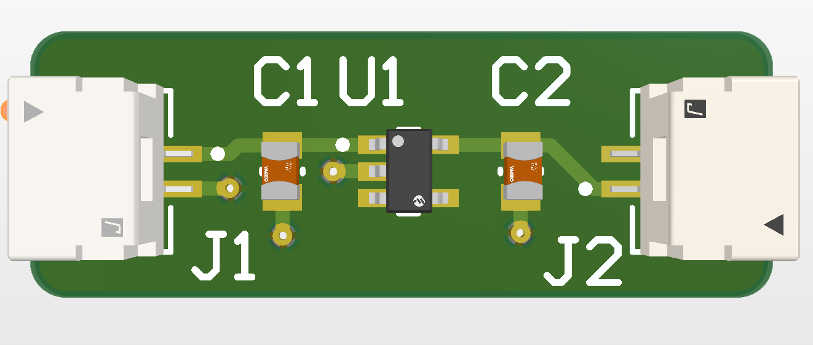

# 🔌 5V → 3.3V LDO Regulator (MIC5317)

## 📌 Overview

Compact linear voltage regulator based on MIC5317, converting 5V input to stable 3.3V output.

Designed for powering:

* Microcontrollers (ESP32, STM32)
* Sensors
* Low-power embedded systems

---

## ⚙️ Specifications

* Input voltage: 5V
* Output voltage: 3.3V
* Max current: ~150 mA
* Regulator: MIC5317
* Capacitors: 1µF (input/output)

---

## 🧩 Schematic

---

## 🖥 PCB Layout

---
## 🖥 PCB-3D Layout

---
## 🧠 Design Notes

* Input/output capacitors placed close to regulator pins
* Short GND return path
* Compact layout for low noise
* Simple and low-cost design

---

## 🔥 Power Dissipation

P = (Vin - Vout) × I
P ≈ (5V - 3.3V) × 0.15A ≈ 0.255W

---

## 📦 Manufacturing

Gerber files available in `/hardware/gerbers.zip`

---

## 🚀 Future Improvements

* Add enable pin control
* Add protection circuits
* Replace with DC-DC for higher efficiency

---

## 👨‍💻 Author

Maksym Pleshyvtsev
Electrical Engineering student (VUT FEKT)
